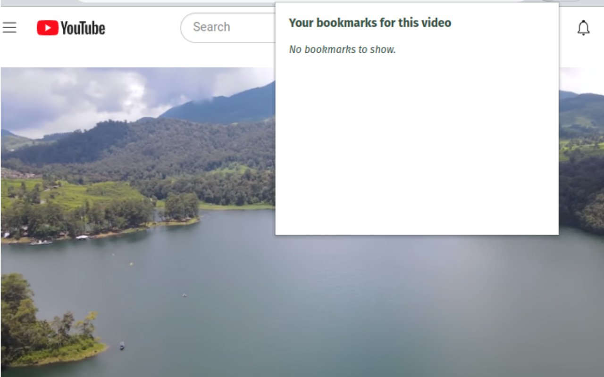
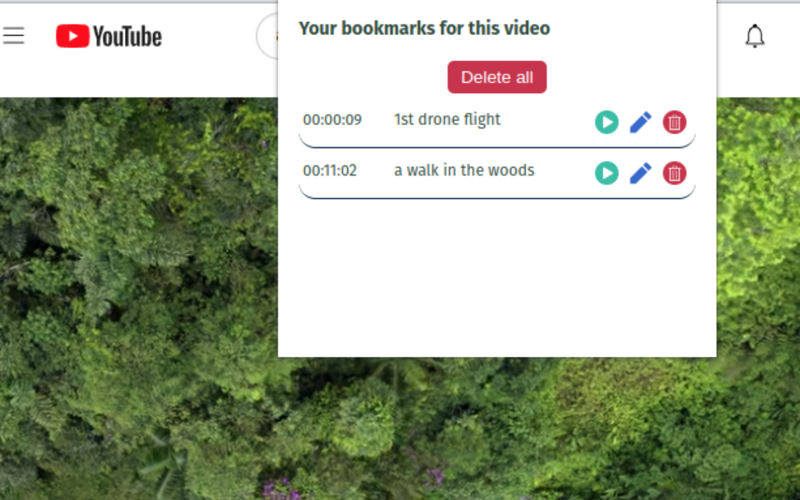
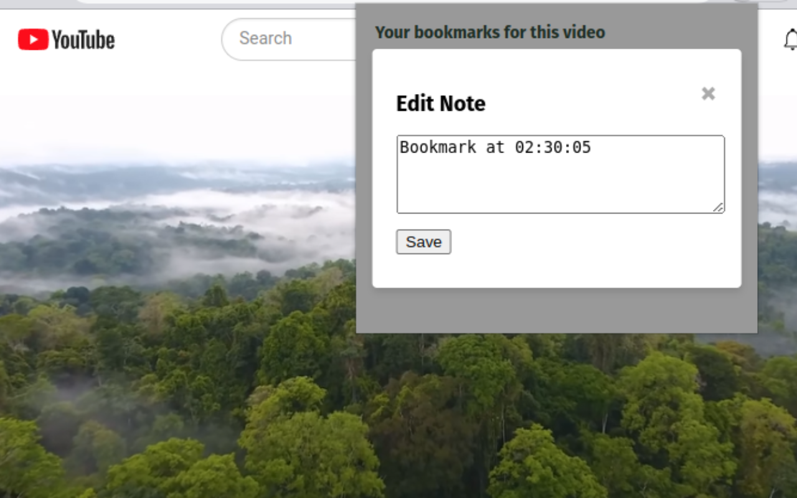

# YT Bookmarker

YT Bookmarker is a Chrome extension that enhances the experience of watching YouTube videos by allowing users to create and manage bookmarks with custom notes at specific timestamps in YouTube videos.



*No Bookmarks*


*With Bookmarks*


*Edit Bookmarks*


## Table of Contents
- [Features](#features)
- [Getting Started](#getting-started)
- [Prerequisites](#prerequisites)
- [Installation](#installation)
- [Usage](#usage)
- [Understanding the Code](#understanding-the-code)
- [Resources](#resources)

## Features

1. Create bookmarks with notes
2. View and manage saved bookmarks
3. Easy navigation to specific timestamps
4. Edit existing bookmarks
5. Delete bookmarks

## Getting Started
Follow these steps to set up MovieWhiz on your local machine.

## Prerequisites

- Google Chrome Browser

## Installation
1. [Fork](https://docs.github.com/en/get-started/quickstart/fork-a-repo) and then clone this repository:

```
git clone https://github.com/<your username>/video-bookmarker.git
```
2. Open Google Chrome.
3. Go to `chrome://extensions/`.
4. Enable "Developer mode" in the top-right corner.
5. Click "Load unpacked extension" and choose the folder where you saved the cloned repository.

The extension should now appear in your Chrome toolbar.

## Usage

1. Open a YouTube video.
2. Click on the YT Bookmarker icon below the video to create a bookmark. 
3. Click on the YT Bookmarker icon in your Chrome toolbar to access your saved bookmarks.
4. Add & edit notes for your bookmarks, navigate to specific timestamps, and delete single or all bookmarks.

## Understanding the Code

In this section, the main logic of the extension in the `popup.js` script is explained.

- `showEditModal`: Displays the edit modal for editing the bookmark text.
- `saveEditedNote`: Saves the edited bookmark text.
- `showFullNote`: Displays the full note when the truncated note is clicked.
- `addNewBookmark`: Adds a new bookmark element to the list of bookmarks.
- `viewBookmarks`: Displays all saved bookmarks for the current video.
- `onPlay`: Jumps to the timestamp of the clicked bookmark.
- `onEdit`: Opens the edit modal for the clicked bookmark.
- `onDelete`: Deletes the clicked bookmark.
- `onDeleteAll`: Deletes all bookmarks for the current video.
- `setBookmarkAttributes`: Sets the attributes and event listeners for bookmark controls.

## Resources

- [Chrome Developer Documentation](https://developer.chrome.com/docs/extensions/mv3/)
